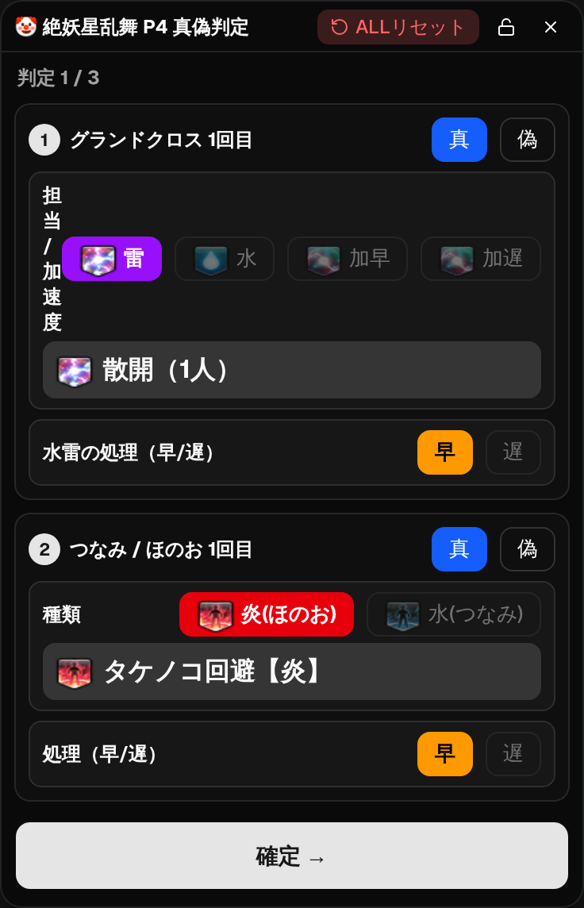
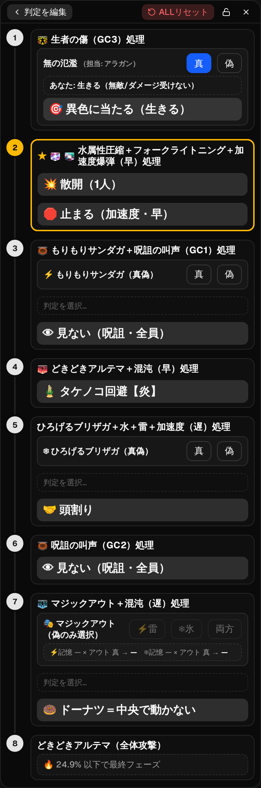

# 絶妖星乱舞 P4 真偽判定カンペ

[](https://github.com/na-xn/kefuka_p4_kanpe/releases/latest)
[](https://github.com/na-xn/kefuka_p4_kanpe/actions/workflows/test.yml)
[](./LICENSE)

FFXIV「絶妖星乱舞 P4」フェーズの**真偽判定カンペ**デスクトップアプリ。判定（真/偽・担当）を入力すると、自分のやるべき行動が**処理順（タイムライン）**で表示されます。ゲーム画面の**最前面に常駐**し、**クリックしてもゲームのフォーカスを奪いません**（オーバーレイ）。音声読み上げ・グローバルキー入力にも対応。

> ⚠️ 個人制作のファンツールです。Square Enix とは無関係で、FINAL FANTASY XIV 関連の名称・ギミック表記の権利は © SQUARE ENIX に帰属します。ゲームの利用規約の範囲内でご利用ください。

## 特長

- 入力ウィザード（3画面: GC1+つなみ/ほのお1 / GC2+つなみ/ほのお2 / GC3）→ 確定 → 処理タイムライン
- GC 担当は「**雷 / 水 / 加速度**」3択＋「**早 / 遅**」を分離。担当・つなみの早遅・呪詛などの**排他関係を自動補助**して入力タップを最小化
- 自分が担当する**加速度爆弾・呪詛発生源**のステップを★強調
- **音声読み上げ**（Web Speech / ja-JP）: 処理画面へ入った瞬間を 0:00 として各処理の手前で読み上げ。開始ホットキー（既定 `Ctrl+Shift+F4`）、音量/秒数調整、着弾済みステップの自動非活性化、終了後 ALL リセット、読み上げログ
- **キー入力**（グローバルショートカット）: `F1〜F3`（既定 `Ctrl+Shift+F1〜F3`）で強調中の入力欄の 1/2/3 番目の選択肢を選び、カーソルが自動前進。フォーカス非奪取でも効く
- ボーダーレス / 常に最前面 / **フォーカス非奪取**（Windows `WS_EX_NOACTIVATE`）
- 右クリックで**透過度**・**自動確定**・**①⑧非表示**・**読み上げ/キー入力**の各設定、ヘッダーの鍵で位置ロック
- ウィンドウ高さはコンテンツに**自動フィット**（メニュー/設定を開くと一時拡大）

## スクリーンショット

| 判定入力（GC1 + つなみ/ほのお1） | 処理タイムライン |
| :---: | :---: |
|  |  |

## ダウンロード / インストール（Windows）

[**Releases**](https://github.com/na-xn/kefuka_p4_kanpe/releases/latest) から `p4-kanpe.exe` をダウンロードし、ダブルクリックで起動（インストール不要）。

- Windows 10 / 11 対応。初回は [WebView2 ランタイム](https://developer.microsoft.com/microsoft-edge/webview2/) が必要（Win11 は標準同梱）。
- SmartScreen の「発行元不明」警告が出た場合は **「詳細情報」→「実行」**。コード署名証明書を使っていないための表示で、動作に問題はありません。
- くわしい使い方は同梱の `README.md`（[release/README.md](release/README.md)）参照。

## 開発

Linux/SSH で UI・ロジックを開発（GTK 不要、Vite のみ）。「常に最前面」など実機挙動の最終確認は Windows（WebView2）で行う。

```bash
pnpm install
pnpm dev      # http://localhost:1420 をブラウザで（Tauri 呼び出しはガード済み）
pnpm build    # 型チェック + フロントの本番ビルド
pnpm test     # ユニット（Vitest）
pnpm e2e      # E2E（Playwright / chromium）
pnpm tauri dev    # デスクトップアプリ起動（要 Rust + WebView2 + GUI セッション）
```

### 配布ビルド / リリース

`.github/workflows/build-windows.yml` が windows-latest 上で `--no-bundle` ビルド（単体 exe のみ）。

- **手動**: Actions →「build-windows」→ Run workflow → `p4-kanpe-windows` アーティファクト（`p4-kanpe.exe` + `README.md`）。
- **リリース**: `git tag vX.Y.Z && git push origin vX.Y.Z` で Draft Release に `p4-kanpe.exe` + `README.md` を添付。

## 技術スタック

Tauri v2 / React 19 / TypeScript / Vite / Tailwind CSS v4 / shadcn(radix-ui) / Vitest / Playwright

## ディレクトリ

| パス | 役割 |
| --- | --- |
| `src/p4/` | ゲームロジック（純粋関数）・型・イベントデータ・読み上げ（`speech.ts`） |
| `src/components/p4/` | UI 部品（入力カード・処理タイムライン） |
| `src/App.tsx` | 状態管理・入力ウィザード・ウィンドウ枠・読み上げ/キー入力（グローバルショートカット） |
| `src-tauri/` | Tauri（Rust）側。`WS_EX_NOACTIVATE` 付与など |
| `e2e/` | Playwright E2E |
| `release/README.md` | 配布物に同梱するユーザー向け説明 |

## ライセンス

[MIT](./LICENSE)
